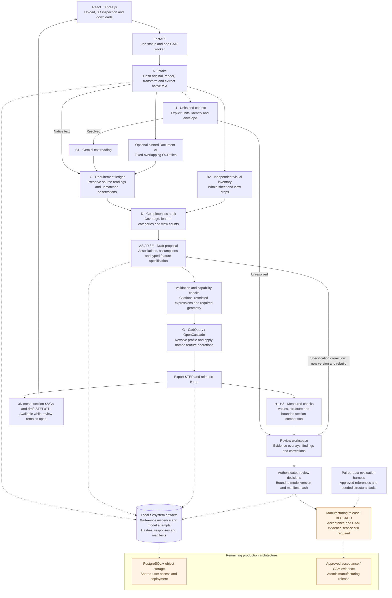
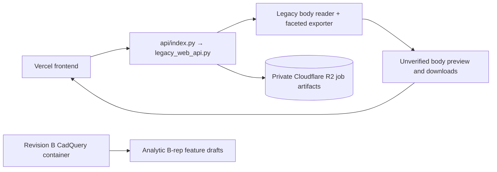

# Drawing-to-STEP

Revision B now connects independent drawing evidence to a traceable **draft** feature
specification, deterministic CadQuery construction, STEP round trip, 3D preview and downloads.
Unresolved requirements remain visible alongside the model. A usable draft is not a
manufacturing release.

See [Revision B implementation status](docs/REVISION_B.md) for supported geometry, review
and correction APIs, validation limits, dataset requirements and remaining production work.

## Current architecture · Revision B

The diagram shows the implemented local draft workflow. Gemini proposes readings and feature
specifications; typed Python contracts and deterministic geometry code validate and build them.
Text reading and visual inventory use separate calls, and the visual call never receives the
text reader's output. Document AI is an optional independent OCR source; without its configured
processor and credentials, its evidence stays `UNAVAILABLE`.



Draft availability and manufacturing approval are separate. Failed operations produce named
findings and a clearly labelled partial draft. `UNKNOWN` stays unresolved; no `FAIL` can be
waived. Source-evidence findings remain visible after construction. Failed rebuilds retain the
last valid preview and downloads, while corrections create new versions and stale earlier
sign-offs. Unsupported measurements return `UNKNOWN` rather than passing by default.

| Responsibility | Implementation |
| --- | --- |
| Intake, independent readers and completeness audit | `revb_pipeline.py`, `revb_ocr.py`, `revb.py` |
| Traceable spec proposals, assumptions and immutable build attempts | `revb_proposal.py`, `revb_build_pipeline.py`, `revb_model.py` |
| Deterministic B-rep construction and reimported STEP checks | `revb_model.py`, `revb_geometry.py`, `revb_sections.py` |
| Versioned corrections, reviewer authorization and release blockers | `web_api.py`, `revb_review.py` |
| 3D feature highlighting, source overlays and correction editor | `Viewer.tsx`, `RevisionBReview.tsx`, `ModelReview.tsx` |
| Frozen paired-data evaluation and seeded-error scoring | `revb_evaluation.py` |

The current builder supports turned profiles and grooves, axial hole patterns, tap-drill
geometry, straight/oblique ports, cylindrical bore notches and circular chamfers. Markings
remain report-only. This is not the complete production architecture: reliable automatic
association, full source-section validation, production storage and manufacturing release
remain unfinished. See the [detailed status and limitations](docs/REVISION_B.md).

The existing Vercel/R2 deployment is retained as a separate legacy body-preview runtime.
It does not run the Revision B pipeline or produce checked analytic STEP geometry:



## Web app

Requires Python 3.12, uv, Node.js 20+, and `GEMINI_API_KEY` in the ignored `.env` or environment.

```sh
uv sync --locked
npm ci --prefix ui
npm run build --prefix ui
uv run uvicorn drawing2step.web_api:app --host 127.0.0.1 --port 8000
```

Open http://127.0.0.1:8000. Upload a single PDF/PNG/JPG sheet, select the correct orientation,
and generate a draft. Inspect the 3D model, feature coverage and source overlays; download
STEP, STL, the ledger, specification and check report. Existing audits have a Build 3D draft
action. Corrections create a new immutable model version and rerun construction and checks. Missing units now require review: Revision B supersedes
the earlier default-mm policy. Selecting an override cannot silently contradict the sheet.

Generating sends drawing evidence to Gemini and, when configured, pinned Document AI. Tokens,
provider responses, crops, transforms and versions stay in ignored local `work/web/` artifacts.
Use the workspace on localhost. Reviewer writes require configured credentials; upload and
draft views are local-only. Manufacturing release stays blocked until paired-data acceptance
and CAM approval exist. Draft STEP downloads are explicitly labelled UNVERIFIED.

New CLI commands: `audit-drawing`, `check-structure`, `eval-revb`, and `accuracy` (score recorded runs against a transcribed drawing truth). Optional cloud OCR requires
`uv sync --locked --extra cloud`, ADC credentials and `DOCUMENT_AI_PROCESSOR_VERSION`; see the
Revision B guide. All tests use recorded responses or synthetic solids unless explicitly live.

## Deployment runtimes

Revision B requires a persistent Python/CadQuery worker. Use the supplied `Dockerfile` or the
local commands above. A minimal install needs `uv sync --locked --no-dev --extra cad` (add
`--extra cloud` for Document AI); the default development install already includes CadQuery.
Revision B currently stores artifacts locally. Its PostgreSQL/object-storage integration and
production job orchestration are still pending.

The existing `api/index.py`, `vercel.json`, `.python-version` and `scripts/build_frontend.py`
retain the earlier Vercel deployment. The build copies the UI to `public/` and `api/frontend/`,
with FastAPI serving the bundled fallback when necessary. The explicit entrypoint imports
`legacy_web_api.py`, keeping heavyweight CadQuery out of that function. Use the repository
root and the FastAPI framework preset; remove obsolete dashboard rewrites/output overrides.

The legacy backend can persist jobs in Cloudflare R2 using environment variables:

```sh
GEMINI_API_KEY=...
CLOUDFLARE_R2_BUCKET=2d-to-3d
CLOUDFLARE_R2_ENDPOINT_URL=https://<account-id>.r2.cloudflarestorage.com
CLOUDFLARE_R2_ACCESS_KEY_ID=...
CLOUDFLARE_R2_SECRET_ACCESS_KEY=...
CLOUDFLARE_R2_PREFIX=drawings
# Optional custom deployment host/origin allowlists
DRAWING2STEP_ALLOWED_HOSTS=example.com,www.example.com
DRAWING2STEP_ALLOWED_ORIGINS=https://example.com,https://www.example.com
```

Keep the bucket private and place credentials only in environment settings or ignored `.env`.
Legacy downloads are served through the application, but those routes are not authenticated
user access controls. The UI labels this mode as a legacy body draft. It cannot satisfy Rev B
completeness, B-rep, or release gates. Moving Revision B onto a hosted CAD worker remains
deployment work; pushing this repository does not perform that migration.

## Historical Rev A tools

The commands below remain isolated feasibility and body-draft tools. Their passing checks do
not establish Revision B acceptance or unlock full-part CAD.

## Run

Requires Python 3.12 and [uv](https://docs.astral.sh/uv/). CadQuery 2.6 requires this runtime
because its VTK dependency does not provide Python 3.13 wheels.

```sh
uv sync --locked
uv run drawing2step init work/prerequisites.json
uv run drawing2step readiness work/prerequisites.json
uv run drawing2step demo --output work/lab
```

The empty readiness manifest deliberately exits **2** and lists the missing prerequisites.
The demo prints a run directory containing `report.html`, `cases.json`, `evaluation.json`,
and `manifest.json`. Open the HTML file directly; no server or credentials are needed.
The demo includes agreed readings, an accepted wrong value, a reader conflict, and a missing
requirement. Non-perfect scores are intentional fault-injection results.

## Available commands

| Command | Behavior |
| --- | --- |
| `init PATH` | Create a blank prerequisite manifest without overwriting an existing file. |
| `inventory MANIFEST` | Print an inventory with SHA-256 hashes for explicitly paired files. |
| `readiness MANIFEST` | Check records, pairs, permissions, split counts and manual baselines. |
| `demo --output DIR` | Run four generated synthetic scenarios and create a standalone report. |
| `eval CASES --output DIR` | Score a JSON array of explicitly declared synthetic evaluation cases. |
| `schema prerequisites` | Print the manifest JSON schema generated from Pydantic. |
| `schema eval` | Print the single-case evaluation JSON schema. |
| `inspect-pdf PDF --rotate 90` | Locally preserve/render one PDF and extract native text. |
| `inspect-pdf PDF --rotate 90 --live` | Send that rendered page to Gemini and save unaccepted reading proposals. |

`inventory` and `readiness` only read and hash local files. They do not copy, render, parse,
upload, or authenticate to any service. Manifest-relative paths resolve relative to the
manifest's directory. Input paths may also be absolute.

The legacy `ingest`, `run --through S9` and `resume` interfaces remain unimplemented.
Revision B provides the current audit/build workflow, optional Document AI adapter and
authenticated local review decisions described above. Production cloud deployment and
manufacturing release remain unfinished; the [Rev A handoff](docs/IMPLEMENTATION.md) is
historical context, not the current implementation status.

## Reconciliation, association review, and body evaluation

`resolve-units RUN --unit mm --confirmed-by NAME --reason TEXT` records an explicit drawing
length-unit decision tied to the original PDF and source ledger hashes. It writes a new
ledger version without modifying raw readings. Explicit callout units and thread designations
are preserved. Units confirmation alone does not approve dimensions, tolerance notes,
associations, or manufacturing release.

```sh
uv run drawing2step reconcile work/pdf-check/RUN_DIRECTORY
uv run drawing2step validate-review RECONCILIATION_DIRECTORY ENGINEER_DECISIONS.json
uv run drawing2step build-body examples/synthetic-ring.json --output work/cad/example
```

`reconcile` correlates saved Gemini boxes with Tesseract words, preserves every OCR observation,
and creates an editable review template. Only plain exact numeric text with one nearby
high-confidence matching word is marked character-corroborated. This is not approval of units,
tolerances or geometry. The template is intentionally incomplete and cannot pass validation
until a reviewer supplies real decisions. Complex callouts stay review items.

`validate-review` checks the evidence fingerprint, unique known requirements, explicit reviewer,
units/tolerances, and requirement/feature dimensional compatibility. It records engineering
associations separately from original readings. It does not validate physical placement,
authenticate a reviewer, or approve a manufacturing release.

`build-body` accepts a closed schema of axial stations with outer/bore diameters. Every value
must cite a dimension or use restricted dimensional arithmetic over citations. Nondecreasing
axial coordinates and nested diameters define a revolved body with linear segments; holes, pins,
slots, threads and ports are not supported by this legacy command. Outputs are
partial evaluation artifacts only, named `evaluation-body.step`, with recorded input spec,
fresh STEP measurements and a verification report. Use a new output directory for each build.

Synthetic examples can run immediately. Real-drawing specs require an explicit engineer and
unit-decision reason; this metadata is not authenticated release approval. The supplied PDF has a recorded user-confirmed mm decision; this does not verify its geometry.

Body checks include valid single-solid topology, analytical profile volume, STEP round-trip
volume/bounding box, and cylindrical diameter extraction. V1 remains UNKNOWN because individual
station conformance is not independently measured. Diameter value matches do not prove feature
location or associations, so V3 stays incomplete. `--reference FILE.step` compares geometry using
boolean symmetric-difference volume; no automatic release follows even if comparison passes.

## Opted-in PDF diagnostic

`uv run drawing2step local-ocr RUN_DIRECTORY` adds independent local Tesseract word evidence
from a saved 600 dpi render. Requires the `tesseract` executable. It checks the render hash,
records the engine version, raw TSV, confidence and normalized word boxes. This diagnostic
does not resolve callout grouping, tolerance interpretation or associations and does not
substitute for the planned pinned Document AI benchmark. Every token remains unaccepted.

The user subsequently authorized a live diagnostic on a supplied PDF. `inspect-pdf` supports
one unencrypted page, metadata rotation zero, up to 20 MB, and a bounded 600 dpi render.
Use `--rotate 90` for a sideways sheet. The original remains unchanged; both 300/600 dpi
renders and the coordinate transform are recorded. A PDF with no embedded text gets an
empty native evidence set, not invented OCR evidence.

Place `GEMINI_API_KEY` in the ignored `.env` file (mode `0600`) or the environment. Environment
values take precedence. The CLI reads the file without shell evaluation or interpolation.
It does not include the key in request URLs, artifacts, or reports.

```sh
uv run drawing2step inspect-pdf '/absolute/path/drawing.pdf' --rotate 90 --live
```

`--live` explicitly opts into sending this drawing's 300 dpi PNG to the fixed Gemini
Developer API endpoint. It is not the verified regional production configuration from the
architecture. Default model: `gemini-3.5-flash`; override with `--model`. Each live invocation
creates a new run and may incur provider charges. Calls have a 60-second timeout and are
not automatically retried. Saved responses can be inspected without another cloud request.

The output contains the original, renders, native evidence, prompt/schema, raw response,
reading proposals, proposed ledger, summary and HTML overlay report. Boxes and feature
associations are model proposals. All entries stay `A_ONLY`, unaccepted and unvalidated.
The unit plausibility check only raises review items; it never resolves units or feeds CAD.
Missing independent OCR/reference STEP and no measured recall mean CAD/release stay blocked.
JSON/schema validity is not drawing completeness. Model-returned drawing identity is a
proposal; the filename is never substituted for it.

On provider or schema failure the command preserves available evidence and writes a failed
diagnostic report, exiting 2. Invalid inputs or a missing key produce an actionable error.

## Prepare the dataset

See [the prerequisite guide](docs/PREREQUISITES.md) for record formats and collection tasks.
Keep originals, permission documents, credentials, and customer metadata outside tracked
source. `work/` and `.env` are ignored by Git.

The inventory detects repeated original content, repeated IDs, group leakage between
development and held-out splits, missing/empty files, unsupported extensions, and changes
to previously recorded hashes. File extensions are checked, not STEP/PDF structural validity.
Drawing identity is entered from the title block by a person; filenames never supply identity.

Even a complete checklist returns `PREREQUISITES_RECORDED`, not production approval.
Prerequisite records alone never approve CAD or manufacturing release. Revision B permits
unverified drafts; human verification and the subsequent accuracy gates remain mandatory
for release.

## Synthetic evaluation behavior

- Match requirements using kind, page, and bounding-box overlap (IoU ≥ 0.5). Only mutually
  unique matches receive credit. Repeated values at different locations remain distinct.
- Compute recall against all ground-truth requirements. Unmatched accepted predictions
  count as accepted errors. Missing denominators produce `null`, never a perfect score.
- Compare exact dimension values and tolerance magnitudes after explicit inch/mm conversion.
  Manufacturing tolerances do not excuse transcription errors. Compare notes by exact text
  after whitespace normalization.
- Report clean/scan cohorts and development/held-out splits separately. Association accuracy
  uses all truth requirements as its denominator in this prototype. UNKNOWN rate includes
  unresolved text, interpretation, or geometry association among predicted requirements;
  missing requirements are captured by recall, not UNKNOWN rate.
- The precedence experiment takes **already-grouped synthetic observations**. It does not
  implement S7 spatial reconciliation. Repeat reads from one source are not independent votes.
- No result establishes production reading accuracy. Geometry conformance is `UNKNOWN`.
  Synthetic latency and cost default to zero because no model or OCR calls are made.

Experiment inputs and outputs are content-addressed. Run identity includes input hashes,
actual Python source hashes, and configuration. Files publish atomically and are checked
for conflicting content on replay. This is application-level local immutability, not cloud
WORM storage or a substitute for storage permissions and retention controls.

## Validate

```sh
uv run ruff check .
uv run ruff format --check .
uv run mypy src
uv run pytest --cov=drawing2step --cov-report=term-missing --cov-fail-under=80
uv build
npm ci --prefix ui
npm run build --prefix ui
```

CI runs the static checks and tests on Python 3.12 using `uv.lock`. Tests use temporary
dummy files and synthetic STEP models only. No customer data, network inference or cloud
deployment is part of the test suite.
