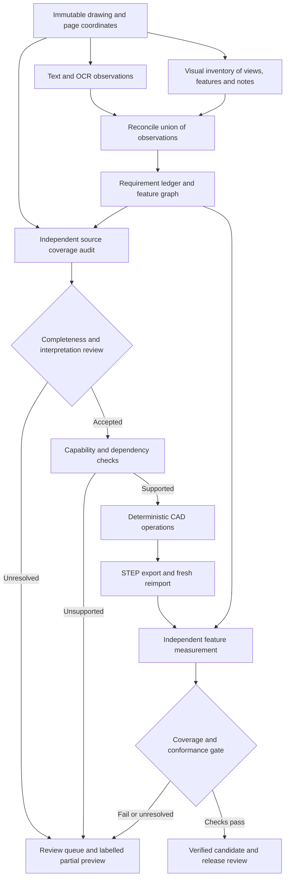

# Architecture for drawing-to-STEP feature completeness

Status: superseded by the user-supplied Revision B. See [current implementation status](REVISION_B.md). This document is the earlier proposal. This extends the existing gated implementation plan. It does not declare reading accuracy, full-part CAD support, or manufacturing release approved.

## Objective and limits

Every drawing requirement must remain traceable through interpretation, representation, construction, and verification. A valid CAD solid must never, by itself, qualify a part as complete.

There are two distinct problems:

1. Discovery completeness: did the system find all requirements in the source drawing?
2. Implementation completeness: did the output satisfy all accepted requirements?

The second can be enforced against a reviewed specification. The first cannot be guaranteed by checking the same model's extraction against itself. Independent source inspection, evaluation against engineer-labelled references, and version-bound completeness review remain necessary. Multiple readers reduce blind spots but may still share errors.

Keep the existing Python, Pydantic, FastAPI, PostgreSQL, CadQuery/OCCT, and React stack. Start with modules and durable stage jobs in one application; this problem does not require separate network services.

## Data flow

Source evidence is available to reviewers at every stage. Early construction may produce explicitly partial evaluation previews, but it cannot bypass completeness or release gates.

## 1. Preserve evidence independently of CAD capabilities

Intake preserves the original file hash, revision, page image, crop-to-page transforms, and extraction versions. Every observation references its page, bounding box or region, raw text or visual evidence, and reader response artifact. Feature outlines, leader lines and view references are evidence as well as text.

Use separate reading responsibilities:

- Native extraction and independent OCR preserve words, dimensions, symbols and notes.
- A visual inventory locates views, sections, hole patterns, recesses, chamfers, ports, markings and otherwise unclassified geometry, including features without readable dimensions.
- A second source-focused audit searches the original page and detailed crops for omissions. It first inventories the source without seeing the builder's simplified spec, then reconciles differences.

Read the whole drawing regardless of what the current CAD builder supports. A body-only prompt must not define the universe of discoverable requirements. Retain unmatched observations, conflicting readings and unavailable reader results. Track which page regions were examined, while recognising that a region being processed does not prove that every annotation in it was understood.

Reconcile the union of observations. Duplicate observations may link to one requirement, but retain all citations. Disagreements affecting geometry require resolution; model confidence or a majority vote does not override them. Unreadable and unfamiliar symbols create review items.

## 2. Create separate requirements, features and representations

An immutable, versioned requirement ledger is the source of truth. Proposed model output, interpreted requirements, and engineer corrections are distinct records.

Each requirement records:

- Stable ID, drawing revision, evidence references and exact source wording.
- Requirement category: geometry, tolerance, thread, marking, material, finish or other process requirement.
- Printed value, unit and tolerance structure; resolved physical value and unit provenance.
- Separate reading, interpretation and association statuses.
- Links to affected features, representation obligations, checks and review decisions.

Each feature records:

- Stable feature ID and typed kind, such as revolved body, hole, pattern, groove, chamfer, drill path or identification marking.
- Parameter references into the ledger, declared datum frame, placement, orientation and dependencies.
- Pattern count and stable instance IDs; relationships such as concentric-with, through-body, intersects-groove and excluded-from-edge-break.
- Construction capability, expected representation and verification obligations.

These are many-to-many relationships: one hole note can require eight instances; one physical feature can depend on several dimensions and views. A count of ledger rows is not a count of physical features.

Tolerance bounds belong to a single dimension requirement. Do not turn upper and lower limits into two independently required physical diameters. Resolve nominal construction values with the approved modelling policy, while preserving the original limits for checks.

Keep the user's unit policy: explicit callout units first, drawing units second, otherwise mm. Record the fallback explicitly. Conflicting explicit units need a review decision; plausibility must not silently change units. Thread designations require their own semantics: nominal NPT size is not a literal bore diameter.

All geometry parameters must cite source evidence, an approved policy, or a restricted, dimensionally checked derivation. Undefined physical placement, thread drill size or marking depth creates an unresolved obligation rather than a guessed value.

## 3. Enforce complete accounting before building

Maintain a coverage relation from source observations to requirements, from requirements to feature/annotation obligations, and from obligations to verification results.

For every source annotation or visual candidate, require either a linked requirement or an explicit, evidenced disposition such as duplicate, reference-only, or unrelated title-block information. A rejected proposal retains its record and reason. Reviewers cannot classify a required physical feature as irrelevant merely because the builder cannot construct it.

For every geometry requirement, require a supported operation or a visible unsupported/manual-work status. For every patterned feature, expand the expected instances so a missing seventh or eighth hole cannot be hidden by a single successful pattern record.

The capability registry declares, for each feature type and parameter range:

- Whether interpretation is supported.
- Whether construction is supported.
- Whether independent verification is supported.
- The representation policy, numerical limits, exclusions and required inputs.

Construction support without verification support produces an unverified candidate. Unsupported required geometry makes the part incomplete. It may still have a labelled partial preview and draft download, but never a complete-model designation.

The engineer reviews the drawing with source overlays and explicitly confirms discovery completeness. That decision binds the original hash and ledger version. It is separate from approving individual values or later STEP measurements.

## 4. Build from a typed feature graph

Replace the station-only specification with an extensible feature graph, retaining the revolved profile as one operation. Start with bodies, grooves, chamfers, straight through/blind holes and circular patterns. Add thread drill geometry with notes, then ports with declared entry faces and drill paths. Add markings under an explicit shop policy.

Deterministic operation handlers consume validated parameters; language models propose readings and associations, never executable CAD code. Each handler returns its feature IDs, construction result, diagnostics and affected geometry references. Topologically sort dependencies and reject cycles or unresolved references.

An operation that fails must not silently disappear while the build continues as successful. Preserve the failed operation and its dependants in the coverage report. Any retained intermediate solid is a partial artifact.

Stable feature IDs belong to the application, not to transient OCCT face numbers. Maintain highlighting links through tessellation, and rebuild those links after geometry changes. Use measured geometric relationships to match reimported features; do not assume export preserves internal face identity.

## 5. Verify the actual exported file

Export STEP and load it afresh. Verification measures that artifact and compares it with the reviewed requirement graph, rather than copying the parameters sent to the builder. Geometry validity and export/reimport integrity are separate checks from drawing conformance.

Verification must be independent of the construction recipe in its logic and evidence. A separate CAD kernel is not a prerequisite; a second function returning the builder's inputs is insufficient independence.

For an eight-hole pattern, check at least:

- Eight distinct physical holes, without reusing one match for multiple instances.
- Diameter within the requirement's tolerance.
- Pitch circle, angular offset and spacing relative to the declared datums.
- Axis orientation, entry/exit faces and through condition.
- No extra or incorrectly positioned hole in the relevant pattern.

For blind holes, check depth and end condition. For chamfers, check the affected edge, dimensions, angle and any exceptions. For a port drilled to meet a groove, prove the intended connection and check unwanted breakthroughs. Matching a diameter anywhere in the solid is insufficient.

Use global topology and volume checks, selected cross-sections and drawing-view projections as additional diagnostics. Projection similarity is not proof of hidden-feature correctness or drawing scale. Ambiguous feature matching is UNKNOWN.

Treat numerical comparison tolerances separately from drawing tolerances. Preserve measurement methods, values, units, uncertainty/limitations and the exact STEP hash in check results.

## 6. Preserve non-solid requirements

Not every drawing requirement should become solid geometry. Surface finish, material, GD&T and some thread information belong in product/manufacturing information or controlled companion records. A physical punch/engraving can require geometry, while its text and manufacturing method also require notes. Do not infer missing letter size or depth.

Declare the representation contract explicitly: which obligations must be in the solid, which in validated STEP PMI, and which in a companion document. A companion note does not satisfy an obligation that explicitly requires a physical hole, marking or embedded PMI. Do not assume the existing STEP exporter emits the requested PMI; test the actual export and receiving CAD/CAM application.

Full product delivery therefore has separate geometry-coverage and non-geometric-requirement checks.

## 7. Make completion a backend decision

Expose distinct statuses to the frontend:

| Status | Meaning |
| --- | --- |
| Needs review | Discovery, interpretation, units or association remains unresolved. |
| Partial model | A known required feature is missing, unsupported or failed. |
| Built, unverified | Geometry exists but its conformance checks are incomplete. |
| Verified candidate | Discovery review is accepted and required automated geometry checks pass. This is not manufacturing release. |
| Approved release | All required release gates and version-bound reviews are satisfied. |

Show expected, built and verified features separately, with individual missing requirements visible beside the 3D model. Keep file-integrity status separate. Avoid a single percentage that suggests all drawing content was discovered simply because all extracted rows were processed.

Known missing required features and FAIL checks block release and cannot be waived. Geometry-driving UNKNOWN checks require the existing plan's individual authorised sign-off with evidence; they remain labelled human-accepted UNKNOWN, not automated PASS. They cannot qualify a model as fully machine-verified.

The backend computes eligibility and atomically binds a release manifest to exact drawing, ledger, feature specification, policy, STEP and check hashes plus valid reviewer decisions. Review writes use expected versions; concurrent corrections or changed inputs invalidate older decisions and rerun affected checks. The download/release endpoint must enforce these states, not just the React button.

## 8. Implementation boundaries and order

Suggested modules, initially in the existing application:

| Module | Responsibility |
| --- | --- |
| `evidence` | Originals, extraction observations, regions, transforms and source versions. |
| `requirements` | Immutable ledger versions, units, tolerances, interpretations and associations. |
| `feature_graph` | Typed features, instance expansion, placements and dependencies. |
| `coverage` | Source accounting, representation obligations, capability checks and missing work. |
| `cad_operations` | Deterministic construction handlers and operation receipts. |
| `verification` | Measurements of reimported artifacts and requirement matching. |
| `review` | Source completeness decisions, corrections and reviewer authorisation. |
| `release` | Eligibility, stale-input rejection and atomic manifests. |

Use PostgreSQL for versions, jobs, decisions and relations; use the existing filesystem artifact interface for immutable files, with Cloud Storage as the later adapter. Stage fingerprints cover source hashes, policy/configuration, schema, implementation and model/prompt versions. Persist attempts and successful artifacts; a fresh model call is new evidence. Duplicate task delivery must not create duplicate releases or overwrite old evidence.

Implementation sequence:

1. Add coverage contracts and backend completion states. Convert existing `unsupported_features` into visible unresolved obligations, without inventing missing source citations. Mark historical runs as partial/unverified and requiring a new discovery audit. Stop equating V2 integrity with drawing conformance.
2. Integrate source-complete reading, independent visual inventory, evidence overlays and completeness review. Implement the approved real-data evaluation harness and reading accuracy gates before expanding CAD capability. Synthetic cases test mechanics, not real drawing accuracy.
3. Add each typed CAD operation together with its independent checker. Begin with body corrections, hole patterns and chamfers; then blind/tapped holes and finally ports/markings. Unsupported types stay visible throughout.
4. Run the shadow pilot and release-gate tests, including stale reviews and concurrent release/correction races. Production rollout still depends on the original dataset, reviewer, policy and CAM-import prerequisites.

Tests must deliberately delete one hole, add an extra hole, rotate a correct-size pattern, swap equal-size features, omit a chamfer, truncate a blind hole, break a drill-to-groove connection, miss a source note, disable a reader and reuse a stale approval. The expected result is a specific failed/unresolved obligation and no complete/released status.

Evaluate discovery recall, accepted-value error, association accuracy and verification error detection separately. Keep development and held-out families/revisions separate; do not tune against held-out failures. Retain the original clean-drawing acceptance targets and report scans independently. Aggregate recall cannot justify ignoring a known missing feature in an individual part.

## References and current implementation anchors

- Current `web_pipeline.py`: capability-limited reading prompt, station-only `DrawingDraft`, unstructured `unsupported_features`, and readiness after V2 integrity.
- Current `body_cad.py`: profile revolution and value-only cylindrical matching. Individual feature location/count conformance remains unverified.
- Current `ui/src/main.tsx`: integrity success shown prominently; omitted features are in expandable notes.
- [CadQuery Shape.isValid](https://cadquery.readthedocs.io/en/latest/classreference.html#cadquery.Shape.isValid) documents shape validity, which is distinct from satisfying a source drawing.
- [NIST STEP File Analyzer and Viewer](https://www.nist.gov/services-resources/software/step-file-analyzer-and-viewer) distinguishes geometry, semantic/graphical PMI, validation properties and format checks.
